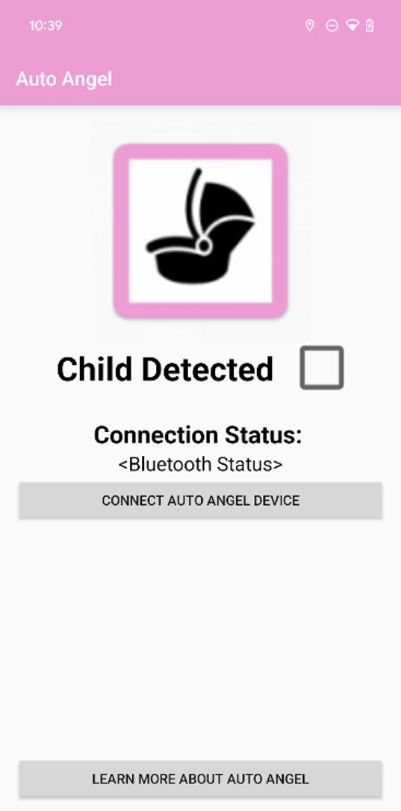

# AutoAngel Appication and Device 

This is a simple android app connected with an arduino device to detect a child left behind in a car. This application has a seperate 
arduino code file that will allow for the recreation of this project. A list of components used to recreate the device is also linked.

## Introduction

This app is designed with the goal to be easy to understand and use. The interface shows a checkbox to show child detection, the Bluetooth connection status, a button for connecting to the Bluetooth device, and a button to learn more about the project.
The functionality of the checkbox is directly linked to the embedded arduino code that sends the boolean 1 or 0 through the HC-05 Bluetooth module to direct the checkbox functionality.

## Required Tools
1. Android Studio IDE and SDK
2. Arduino IDE
3. Solidworks
4. [Component List](/Components.md)

## Setup
1. Clone the app code including the gradle files from this repository to android studio
2. Clone the arduino code into the arduino IDE ([Arduino Code](/ArduinoCode))
3. Print the box using the [3D print files](/final_3D_print_files)
4. Fabricate the device using the listed components
5. Install the app onto an Android device
6. Run the app on the Android device and connect to the Bluetooth module on the fabricated device and the application will work as intended

## Project Video
Here is a link to a video created by the team who put this project together.
 [Video Link](https://www.youtube.com/watch?v=gP2UwRox2-k)
